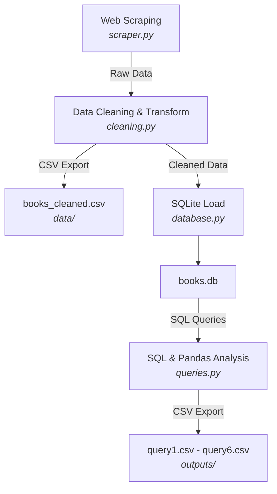

# Data Pipeline (ETL Pipeline)

This project is a complete Extract, Transform, Load (ETL) data engineering pipeline that scrapes book data from [books.toscrape.com](https://books.toscrape.com/), cleans it, applies currency conversion, loads it into a normalized SQLite database, and executes SQL/Pandas analytical queries.

## ETL Workflow



## Project Structure

```
data_pipeline/
├── scraper.py       # Handles HTTP requests, HTML parsing, and URL traversal
├── cleaning.py      # Data cleaning, error handling, and formatting
├── database.py      # SQLite table creation and relational data insertion
├── queries.py       # SQL queries execution, export, and Pandas merge
├── main.py          # Orchestrates the ETL pipeline 
├── requirements.txt # Python dependencies
├── README.md        # Project documentation
├── books.db         # Output SQLite database (generated at runtime)
├── data/
│   └── books_cleaned.csv  # Cleaned intermediate data (generated at runtime)
└── outputs/         # Analytical query results in CSV (generated at runtime)
```

## Installation

Ensure you have Python 3.8+ installed. Install the dependencies using:

```bash
pip install -r requirements.txt
```

## Run

To execute the entire ETL pipeline automatically, run:

```bash
python main.py
```

## Database Schema

The pipeline uses a normalized relational schema composed of two tables:

### 1. `categories` Table
- `category_id`: INTEGER PRIMARY KEY AUTOINCREMENT
- `category_name`: TEXT UNIQUE NOT NULL

### 2. `books` Table
- `book_id`: INTEGER PRIMARY KEY AUTOINCREMENT
- `title`: TEXT NOT NULL
- `price_gbp`: REAL NOT NULL
- `price_inr`: REAL NOT NULL
- `rating`: INTEGER CHECK(rating BETWEEN 1 AND 5)
- `in_stock`: INTEGER NOT NULL (0 or 1 for Boolean)
- `category_id`: INTEGER NOT NULL

**PK/FK Relationship:** 
The `category_id` in the `books` table is a Foreign Key that references `category_id` in the `categories` table. SQLite's `PRAGMA foreign_keys = ON;` is strictly enabled to enforce this relationship, preventing orphan records.

## Cleaning Decisions

- **Price Cleaning:** The currency symbol `£` is stripped from the price string and the remaining text is converted to a `float`.
- **Rating Conversion:** Text-based star ratings ("One", "Two", "Three", "Four", "Five") are mapped to standard integers (1, 2, 3, 4, 5).
- **Availability Conversion:** "In stock" strings are converted to boolean `True` (stored as `1` in SQLite), and "Out of stock" to `False` (`0`).
- **Error Handling:** The pipeline uses a strict **drop malformed rows** strategy. If any column fails parsing (e.g., unexpected rating text, missing price), a `ValueError` is raised and caught, the row is dropped, and a `WARNING` is logged detailing the dropped title and reason.

## Currency Conversion

All prices are converted from British Pounds (GBP) to Indian Rupees (INR) using a fixed, project-defined conversion rate:
**`1 GBP = 105.50 INR`**

This conversion is applied during the cleaning phase and both values are preserved in the database (`price_gbp` and `price_inr`).

## SQL Queries

The pipeline executes the following 6 queries to demonstrate comprehensive SQL capabilities:

1. **Books with rating >= 4:** Demonstrates `SELECT + WHERE`.
2. **Most expensive books:** Demonstrates `ORDER BY + LIMIT` by returning the top 5 highest-priced books.
3. **DISTINCT categories:** Demonstrates `DISTINCT` by fetching unique category names.
4. **Books priced BETWEEN two values:** Demonstrates `BETWEEN` by finding books priced £10 to £20.
5. **Books with ratings IN (4,5):** Demonstrates the `IN` clause.
6. **JOIN books with categories:** Demonstrates an `INNER JOIN` to fetch the book title, price, and associated category name.

## Outputs

All exported files are generated inside the project directory:
- **Cleaned Data:** Saved to `data/books_cleaned.csv` before database insertion.
- **Query Results:** Saved to the `outputs/` directory as `query1.csv` through `query6.csv`.
