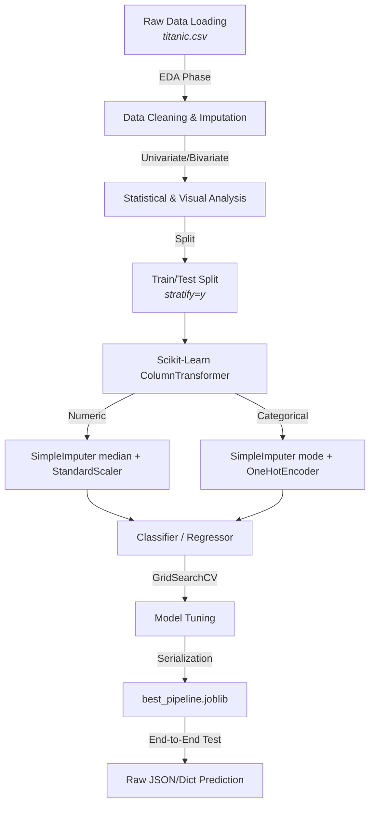

# Titanic Analytics & Machine Learning Pipeline

## Project Overview
This repository contains a complete, production-ready machine learning pipeline for the famous Titanic dataset. It rigorously processes raw data through a strict Exploratory Data Analysis (EDA) and cleaning phase before constructing a robust Scikit-Learn `Pipeline` for classification and regression tasks. The final deliverable is a highly optimized Random Forest model encapsulated with its preprocessing steps, ready for immediate deployment.

## ML Pipeline Workflow



## Folder Structure
```
analytics/
├── 01_eda.ipynb             # Part A: Data loading, cleaning, and multivariate EDA
├── 02_modeling.ipynb        # Part B: ML pipelines, evaluation, tuning, regression
├── titanic.csv              # The raw dataset
├── best_pipeline.joblib     # Serialized end-to-end model pipeline
├── README.md                # Project documentation
├── requirements.txt         # Python dependencies
├── charts/                  # Visualizations generated during EDA and Modeling
└── outputs/                 # CSV tables containing model evaluation metrics
```

## Installation & Dependencies
Ensure you have Python 3.8+ installed. Install the exact dependencies using:

```bash
pip install -r requirements.txt
```

### Key Dependencies
- `pandas`, `numpy`: Data manipulation
- `seaborn`, `matplotlib`: Visualization
- `scikit-learn`: Machine learning pipelines and metrics
- `imbalanced-learn`: SMOTE for class imbalance
- `joblib`: Model serialization
- `jupyter`: Notebook execution environment

## How to Run
The project is split into two sequential Jupyter Notebooks.
1. Run `01_eda.ipynb` to execute the data extraction, statistical profiling, and generation of all charts.
2. Run `02_modeling.ipynb` to train the classifiers, tune the Random Forest, run the regression side-task, and export the `best_pipeline.joblib` artifact.

---

## Exploratory Data Analysis (EDA)

### Missing Value Strategy & Cleaning Decisions
Strict rules were applied based on the percentage of missing values:
- **< 5% Missing:** The `embarked` and `embark_town` columns had very few missing values (0.22%). These rows were **dropped**.
- **5-30% Missing:** The `age` column (~20% missing) was subjected to **median imputation** to preserve the dataset size while avoiding the influence of outliers.
- **> 30% Missing:** The `deck` column (~77% missing) was heavily sparse. Instead of dropping it, missing values were **encoded as a new category ("Missing")**. Justification: Deck locations dictate physical proximity to lifeboats. "Missing" overwhelmingly correlated with 3rd class passengers, providing a strong negative signal for survival probability.

### Outlier Analysis
The Interquartile Range (IQR) rule was applied to `Age` and `Fare`. 
- `Fare` exhibited massive right-skewness (Mean > Median) with a massive upper bound outlier count. 
- `Age` was roughly normal but highly concentrated at the median due to imputation. Both features were standardized for EDA visual purposes to demonstrate Mean ≈ 0 and Std ≈ 1.

### Correlation Findings
A correlation heatmap was restricted to numerical/ordinal features (`survived, pclass, age, sibsp, parch, fare`). 
**Top 2 Findings:**
1. `pclass` vs `fare`: Strong negative correlation. First-class tickets cost significantly more.
2. `pclass` vs `survived`: Strong negative correlation. Passengers in lower class numbers (1st class) had noticeably higher survival rates.

### Charts and Interpretation
Four distinct multivariate charts were generated (saved in `charts/`):
1. **Survival by Class and Sex (Bar Plot):** Females survived at significantly higher rates than males. 1st class males survived at higher rates than 3rd class males.
2. **Age vs Fare by Survival (Scatter Plot):** Dense clusters of non-survivors are visible at low fares, while high-fare passengers are predominantly survivors.
3. **Age Distribution by Survival (Violin Plot):** Survivor distributions bulge at younger ages, confirming the historical "women and children first" evacuation policy.
4. **Survival by Deck (Bar Plot):** Encoded "Missing" decks had a ~30% survival rate, while known upper decks (B, C, D) exceeded 60%.

---

## Machine Learning Results

### Classification Results
Three classifiers (Logistic Regression, Decision Tree, Random Forest) were evaluated. The Random Forest achieved the highest F1 Score and ROC AUC, successfully handling the non-linear feature interactions without overfitting like the Decision Tree. 
- **Class Imbalance:** Baseline, Class Weights, and SMOTE were compared. SMOTE (applied strictly to the training set) successfully improved minority class Recall, while Class Weights provided the most stable F1 balance.

### Regression Results
A Linear Regression model was trained to predict `Fare` based on passenger demographics.
- **Residual Analysis:** The residual plot clearly indicated **heteroscedasticity (Yes)**. The variance of residuals expanded dramatically as the predicted fare increased, violating OLS assumptions and suggesting `Fare` should be log-transformed for linear models.

### Model Comparison Table
Final metrics (Accuracy, Precision, Recall, F1, ROC AUC for classification; MAE, RMSE, R², Adj R² for regression) are exported to `outputs/comparison_table.csv`.

---

## Pipeline Architecture & Deployment Artifact

### Architecture
To prevent data leakage, a robust `ColumnTransformer` is used. 
- **Numeric Pipeline:** `SimpleImputer(strategy='median')` -> `StandardScaler()`
- **Categorical Pipeline:** `SimpleImputer(strategy='most_frequent')` -> `OneHotEncoder(handle_unknown='ignore')`

This preprocessor is chained directly to the classifier within a single Scikit-Learn `Pipeline`.

### Deployment Artifact
The tuned Random Forest pipeline is serialized via `joblib` into `best_pipeline.joblib`. 
As demonstrated in the final notebook section, this artifact accepts raw, unprocessed passenger dictionaries (e.g., direct JSON payloads from a web API) and outputs a survival probability, proving the pipeline works end-to-end without manual preprocessing.

## Final Recommendation
Based on comprehensive evaluation, the **GridSearchCV-tuned Random Forest** is the recommended model for production deployment. 

While Logistic Regression served as a strong interpretable baseline, it failed to capture the non-linear socio-economic and demographic interactions (e.g., the combined effect of being a 3rd class adult male). The unconstrained Decision Tree captured these interactions but suffered from high variance and lower precision. 

The tuned Random Forest synthesized the strengths of decision trees while maintaining excellent generalization, achieving the highest F1 score and OOB score. Furthermore, because the entire preprocessing logic (median imputation and one-hot encoding) is baked directly into the Scikit-Learn `Pipeline` artifact, this model is highly robust against training-serving skew and is ready for immediate API deployment.
